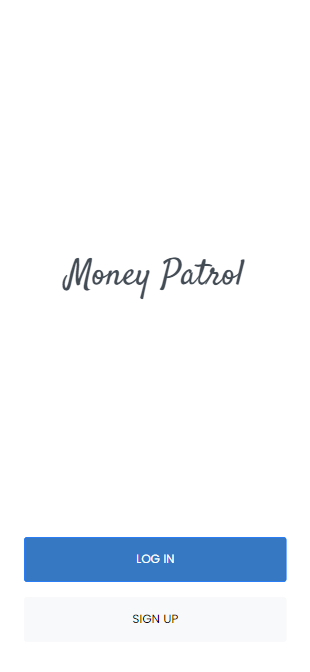
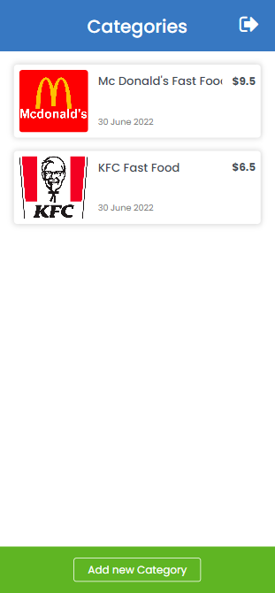
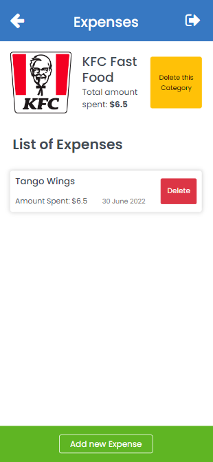

# Money Patrol

> Divide your expenses into categories and keep a check on them.

<p style="display: flex; align-items: center; gap: 10px">
  
  
  
</p>

Created while learning Ruby on Rails as a Capstone project. You can add new categories, add expenses in those categories to keep a track of where you spend all your money.

## Built with

- Ruby
- Rails
- Postgresql
- Bootstrap
- SCSS

## Live Demo

- Check it out on [Heroku](https://money-patrol.herokuapp.com/)

## Getting Started

To get a local copy up and running follow these simple example steps.

### Prerequisites

- Ruby
- Rails
- Postgresql

### Setup

- Clone the Repository
- Go to the project directory
- Run ```bundle install```
- Run ```rails db:create```
- Run ```rails db:migrate```
- Run ```yarn build``` to generate necessary javascript code
- Run ```yarn build:css``` to generate necessary styling

### Usage

- Run ```rails s``` to run the app

## Authors

👤 **Awais Amjed**

- GitHub: [@awais-amjed](https://github.com/awais-amjed)
- LinkedIn: [@awais-amjed](https://www.linkedin.com/in/awais-amjed/)

## 🤝 Contributing

Contributions, issues, and feature requests are welcome!

Feel free to check the [issues page](../../issues/).

## Show your support

Give a ⭐️ if you like this project!

## Acknowledgments

- Microverse

## 📝 License

This project is [MIT](./LICENSE) licensed.
